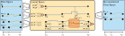

# bnode-core
Balanced Neural ODEs - Core Library
## Description
This repository contains code implementing "Balanced Neural ODEs" (BNODEs) as described in the paper:

- Julius Aka, Johannes Brunnemann, Jörg Eiden, Arne Speerforck, Lars Mikelsons. "Balanced Neural ODEs: nonlinear model order reduction and Koopman operator approximations", ICLR 2025. [OpenReview](https://openreview.net/forum?id=nA464tCGR5) ([bibtex key](#citation))

Balanced Neural ODEs (BNODEs) are a data-driven method to learn reduced-order models for high-dimensional dynamical systems. The approach combines Variational Autoencoders (VAEs) with Neural Ordinary Differential Equations (Neural ODEs) to learn a low-dimensional latent representation of the system's dynamics.



It consits of the following main components:
- *Encoder*: Maps high-dimensional input data to a low-dimensional latent space. Distinct encoders are use for
    - (physical) parameter encoding (if applicable)
    - Control input encoding (if applicable)
    - Initial state encoding (intended to be used for simulation data with acces on the full state)
- *Neural ODE*: Models the dynamics in the latent space using a neural network to parameterize the ODE.
- *Decoder*: Reconstructs the high-dimensional data from the latent representation.

Each component can be set to be a nonlinear neural network or to be a purely linear model, allowing for flexibility in model complexity. For example, using linearity in the control encoder, the Neural ODE and the decoder results in a Koopman operator approximation for model-predictive control. 

The main features of the package this repository implements are:
- **Dataset generation**: Functions to generate dataset from physical models provided as FMU (Functional Mock-up Unit, [FMI standard](https://fmi-standard.org/)) with different sampling methods.
- **Model training**: Architecture implementation of BNODEs and state space NeuralODEs using [PyTorch](https://pytorch.org/) and [torchdiffeq](https://github.com/rtqichen/torchdiffeq). Both models can be trained using the same trainer, facilitating a lot of special considerations needed for training Neural ODEs.
- Various utilties for enabling an efficient workflow, e.g. logging with [mlflow](https://mlflow.org/), configuration management with [hydra](https://hydra.cc/) and a simple GUI for visualizing training results.


## Installation
1. Clone the repository:
   ```
    git clone <repository-url>
    cd bnode-core
    git submodule update --init #no need for recursive update
    ```
2. [Install uv](https://docs.astral.sh/uv/getting-started/installation/), a very-fast python package manager.

You're done!

3. (Optional:) If you want a virtual environment, run:
```
    uv sync
```
to install a virtual environment of the project defined in pyproject.toml. You can also use ```uv sync``` to test if the package can be installed in the way you specified it. To activate the virtual environment, use:

```[linux-bash]
source .venv/bin/activate
[windows-powershell]
.venv\Scripts\Activate
```

You don't need to install the virtual environment, **you can simply** place ```uv run``` in front of the python-file you want to run to make it run in the specified environment.

## Usage
TODO: Add reference to mkdocs

## Support
If you have questions or issues, please open an issue on GitHub. You can also reach out to me via [email](mailto:julius.aka@uni-a.de), see [Authors](#authors).

## Contributing
You are welcome to contribute further test models to this project. Please fork the repository and create a pull request with your changes.

<a id="authors"></a>
## Authors
- Julius Aka, 
Chair of Mechatronics, 
University of Augsburg,
<julius.aka@uni-a.de>
- Johannes Brunnemann
- Jörg Eiden
- Arne Speerforck
- Lars Mikelsons

<a id="citation"></a>
## Citation
If you use this code in your research, please cite the following paper:
```
@inproceedings{
aka2025balanced,
title={Balanced Neural {ODE}s: nonlinear model order reduction and Koopman operator approximations},
author={Julius Aka and Johannes Brunnemann and J{\"o}rg Eiden and Arne Speerforck and Lars Mikelsons},
booktitle={The Thirteenth International Conference on Learning Representations},
year={2025},
url={https://openreview.net/forum?id=nA464tCGR5}
}
```

## License
This project is licensed under the MIT License - see the [LICENSE](LICENSE) file for details.